# Tellhow Vue Snippets for Visual Studio Code

## Component

主要为Vue基础组件库提供代码片段

```sh
    npm i th-vue-component -S
```

## Snippets

### vue模板快捷键

`t-`开头

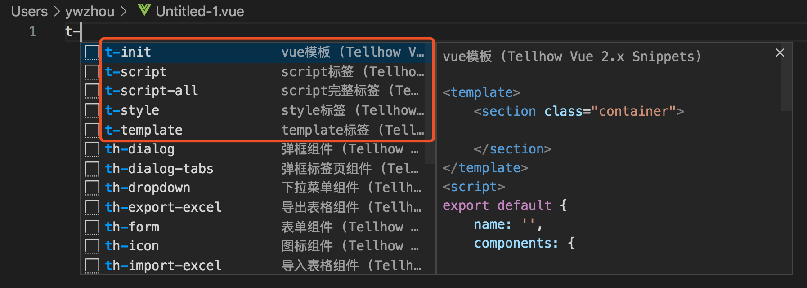

| 快捷键 | 生成内容 |
| ------ | ------------ |
| `t-init` | `vue模板` |
| `t-template` | `template标签` |
| `t-script` | `script标签` |
| `t-script-all` | `script完整标签` |
| `t-style` | `style标签` |

### html标签快捷键

`th-`开头

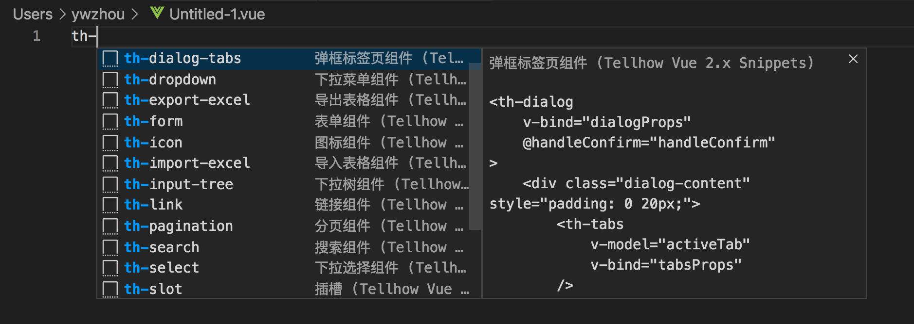


| 快捷键 | 生成内容 |
| ------ | ------------ |
| `th-icon` | `图标组件` |
| `th-link` | `链接组件` |
| `th-select` | `下拉选择组件` |
| `th-input-tree` | `下拉树组件` |
| `th-title` | `标题组件` |
| `th-form` | `表单组件` |
| `th-pagination` | `分页组件` |
| `th-table` | `表格组件` |
| `th-slot` | `组件内插槽` |
| `th-search` | `搜索组件` |
| `th-dialog` | `弹框组件` |
| `th-tabs` | `标签页组件` |
| `th-dialog-tabs` | `弹框标签页组件` |
| `th-dropdown` | `下拉菜单组件` |
| `th-timeline` | `时间线组件` |
| `th-tooltip` | `省略提示组件` |
| `th-import-excel` | `导入表格组件` |
| `th-export-excel` | `导出表格组件` |


### util工具类快捷键

`u-`开头

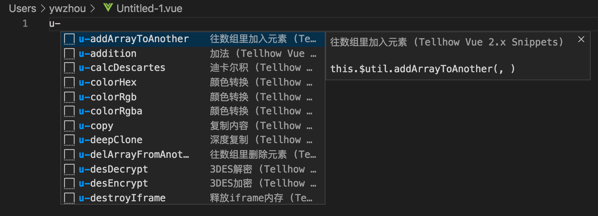


| 快捷键 | 生成内容 |
| ------ | ------------ |
| `u-moment` | `日期` |
| `u-moment-add` | `之后日期` |
| `u-moment-subtract` | `之前日期` |
| `u-deepClone` | `图标组件` |
| `u-serialize` | `序列化` |
| `u-length` | `判断数组长度` |
| `u-copy` | `复制内容` |
| `u-download` | `下载文件` |
| `u-validatenull` | `判断是否为空` |
| `u-detailDataType` | `字符串数据类型转化` |
| `u-calcDescartes` | `迪卡尔积` |
| `u-getObjType` | `判断数据类型` |
| `u-diff` | `判断路由是否相等` |
| `u-encryption` | `AES加密处理` |
| `u-desEncrypt` | `3DES加密` |
| `u-desDecrypt` | `3DES解密` |
| `u-randomNum` | `生成随机len位数字` |
| `u-randomWord` | `生成随机len位字母数字` |
| `u-getLeaveTime` | `获取剩余时间` |
| `u-loopOptions` | `转换级联下拉数据` |
| `u-getTreeIds` | `通过Id获取级联数据id数组` |
| `u-multiplication` | `乘法` |
| `u-addition` | `加法` |
| `u-runTime` | `持续时长 (秒)` |
| `u-addArrayToAnother` | `往数组里加入元素` |
| `u-delArrayFromAnother` | `往数组里删除元素` |
| `u-getImgToBase64` | `将图片转换为Base64` |
| `u-colorHex` | `颜色转换` |
| `u-colorRgb` | `颜色转换` |
| `u-colorRgba` | `颜色转换` |
| `u-destroyIframe` | `释放iframe内存` |
| `u-getQueryString` | `查询请求参数` |

### rule校验规则快捷键

`r-`开头

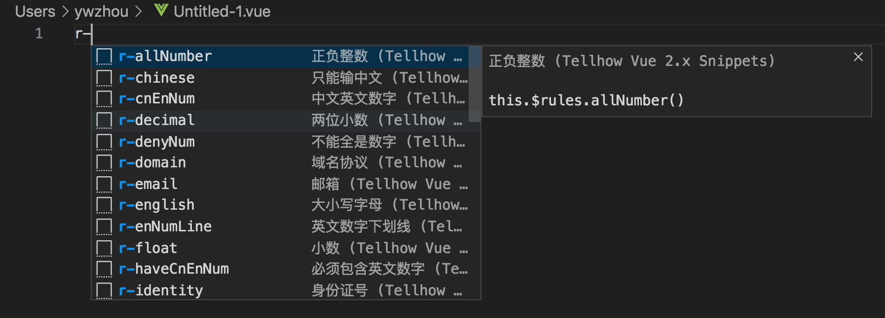

| 快捷键 | 生成内容 |
| ------ | ------------ |
| `r-validator` | `自定义验证` |
| `r-required` | `必填` |
| `r-requiredManual` | `手动必填` |
| `r-requiredArray` | `数组必填` |
| `r-requiredObject` | `对象必填` |
| `r-length` | `字符串固定长度` |
| `r-len` | `字符串长度范围` |
| `r-min` | `字符串最小长度` |
| `r-max` | `字符串最大长度` |
| `r-minNum` | `最小数` |
| `r-maxNum` | `最大数` |
| `r-rangeNum` | `数值范围` |
| `r-type` | `类型` |
| `r-email` | `邮箱` |
| `r-upperCase` | `大写字母` |
| `r-lowerCase` | `小写字母` |
| `r-english` | `大小写字母` |
| `r-chinese` | `只能输中文` |
| `r-noChinese` | `不能输中文` |
| `r-cnEnNum` | `中文英文数字` |
| `r-specialChar` | `不能包含特殊字符` |
| `r-path` | `路径` |
| `r-enNumLine` | `英文数字下划线` |
| `r-denyNum` | `不能全是数字` |
| `r-type` | `英文数字` |
| `r-haveCnEnNum` | `必须包含英文数字` |
| `r-mobile` | `手机号` |
| `r-phone` | `座机` |
| `r-phone2` | `座机(区号-座机号-分机号)` |
| `r-phoneAll` | `手机或座机` |
| `r-float` | `小数` |
| `r-decimal` | `两位小数` |
| `r-number` | `整数` |
| `r-allNumber` | `正负整数` |
| `r-plusNumber` | `正数` |
| `r-ip` | `ip地址` |
| `r-identity` | `身份证号` |
| `r-postal` | `邮政编码` |
| `r-domain` | `域名协议` |

### localStorage存储快捷键

`s-`开头

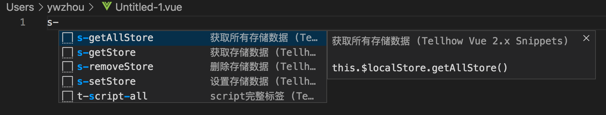


| 快捷键 | 生成内容 |
| ------ | ------------ |
| `s-getStore` | `获取存储数据` |
| `s-setStore` | `设置存储数据` |
| `s-removeStore` | `删除存储数据` |
| `s-getAllStore` | `获取所有存储数据` |

### mixin混入快捷键

`m-`开头

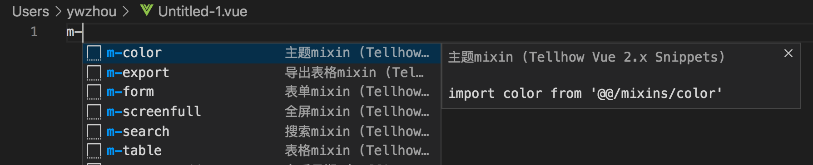


| 快捷键 | 生成内容 |
| ------ | ------------ |
| `m-table` | `表格mixin` |
| `m-form` | `表单mixin` |
| `m-search` | `搜索mixin` |
| `m-export` | `导出表格mixin` |
| `m-screenfull` | `全屏mixin` |
| `m-color` | `主题mixin` |

### data初始数据快捷键

`d-`开头

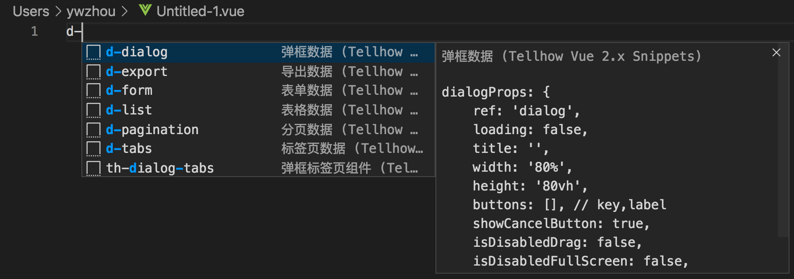

| 快捷键 | 生成内容 |
| ------ | ------------ |
| `d-list` | `表格数据` |
| `d-form` | `表单数据` |
| `d-dialog` | `弹框数据` |
| `d-export` | `导出数据` |
| `d-pagination` | `分页数据` |
| `d-tabs` | `标签页数据` |


### directive自定义指令快捷键

`v-`开头

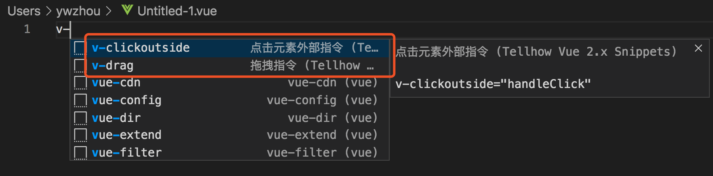

| 快捷键 | 生成内容 |
| ------ | ------------ |
| `v-drag` | `拖拽指令` |
| `v-clickoutside` | `点击元素外部指令` |

### http请求快捷键

`h-`开头

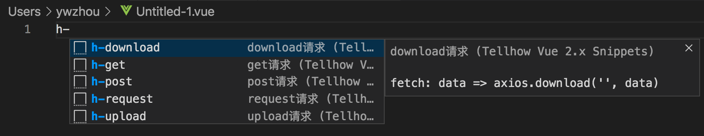

| 快捷键 | 生成内容 |
| ------ | ------------ |
| `h-get` | `get请求` |
| `h-post` | `post请求` |
| `h-download` | `download请求` |
| `h-upload` | `upload请求` |
| `h-request` | `this.$request` |

### vuex存储快捷键

`x-`开头

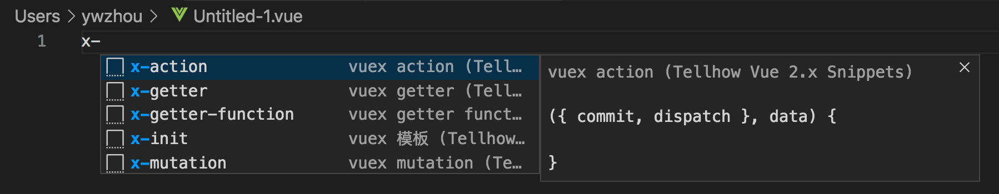

| 快捷键 | 生成内容 |
| ------ | ------------ |
| `x-init` | `vuex 模板` |
| `x-mutation` | `vuex mutation` |
| `x-action` | `vuex action` |
| `x-getter` | `vuex getter` |
| `x-x-getter-function` | `vuex getter function` |
| `x-get` | `get请求` |
| `x-get` | `get请求` |

### ElememntUI快捷键

`el-`开头

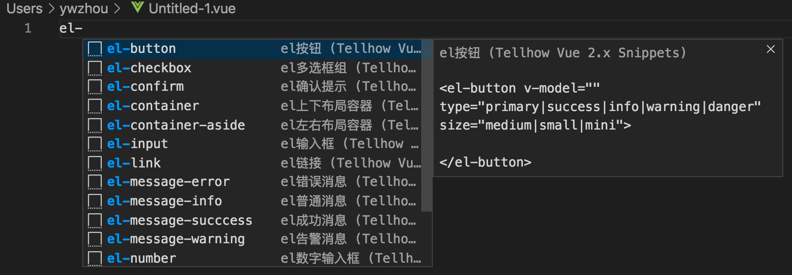


| 快捷键 | 生成内容 |
| ------ | ------------ |
| `el-message-info` | `el普通消息` |
| `el-message-succcess` | `el成功消息` |
| `el-message-warning` | `el告警消息` |
| `el-message-error` | `el错误消息` |
| `el-confirm` | `el确认提示` |
| `el-notify` | `el消息通知` |
| ------ | ------------ |
| `el-container` | `el上下布局容器` |
| `el-container-aside` | `el左右布局容器` |
| `el-row` | `el行容器` |
| `el-col` | `el列容器` |
| `el-button` | `el按钮` |
| `el-link` | `el链接` |
| `el-radio` | `el单选框组` |
| `el-checkbox` | `el多选框组` |
| `el-input` | `el输入框` |
| `el-textarea` | `el多行输入框` |
| `el-number` | `el数字输入框` |
| `el-select` | `el下拉选择` |
| `el-cascader` | `el级联选择` |
| `el-switch` | `el开关` |
| `el-time` | `el下拉选择` |
| `el-date` | `el下拉选择` |
| `el-tree` | `el树选择` |
| `el-tabs` | `el标签页` |
| `el-dialog` | `el弹出框` |
| `el-tooltip` | `el提示` |
| `el-popover` | `el气泡` |
| `el-popconfirm` | `el气泡确认` |
| `el-image` | `el图片` |


## Deploy

### 方式一、打包插件

```sh
    npm i vsce -g
    vsce package
```

打包成vsix插件，发送给别人进行安装
切换到扩展页，点击右上角...选择`Install form VSIX`

### 方式二、发布到应用市场

[注册登录](https://login.live.com/)

[访问Azure](https://aka.ms/SignupAzureDevOps)

创建令牌：personal access tokens，保存好

```sh
    npm i vsce -g
    # 创建发布账号, 输入昵称、邮箱、令牌
    vsce create-publisher ywzhou
    # 登录, 创建后不需要再登录
    vsce login ywzhou
    # 发布，每次更新要修改版本号
    vsce publish
```

[应用市场查找](https://marketplace.visualstudio.com/items?itemName=ywzhou.th-vue-snippets)


